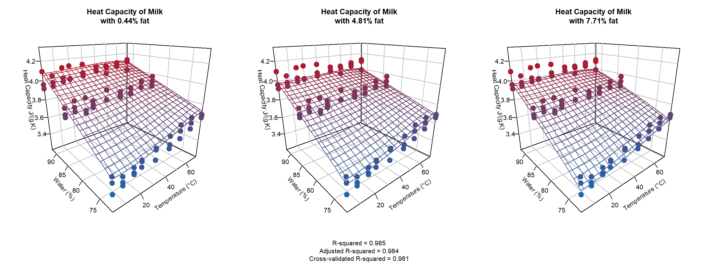
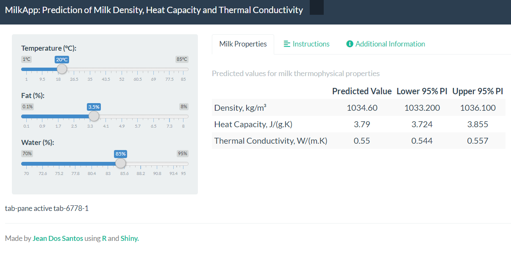

# Modeling of the Thermophysical Properties of Milk
**Predicting the Heat Capacity, Thermal Conductivity and Density of Milk with Temperature, Water and Fat Content**

## Objectives

The objective of this repo was to develop statistical models that predict the some thermophysical properties of cow's milk based on the % of fat and water. The properties modelled were:
- Heat Capacity
- Thermal Conductivity 
- Density

Various polynomials functions were trained and tested on a training set using best subset regression (BSS) and assessed using R-squared, adjusted-R-squared and cross-validation statistics using leave-one-out cross validation (LOOCV). The final models selected were assessed on a hold-out test set.

***
## Report

A report with the exploratory data analysis, modeling and model validation is available on [RPubs](https://rpubs.com/jeandsantos88/milk_thermophysical_properties).

***
## App

A online app for the prediction of the thermophysical properties is [available online](https://jeandsantos.shinyapps.io/App_Milk_Thermophysical_Properties/) hosted by ShinyApps.

***

## Data

The data used for this project were obtained from the research paper [*Influence of Temperature and Water and Fat Contents on the Thermophysical Properties of Milk*](https://pubs.acs.org/doi/pdfplus/10.1021/je025546a), Minim et al., Journal of Chemical & Engineering Data 2002 47 (6), 1488-1491.

